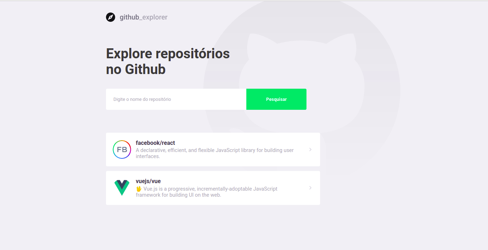
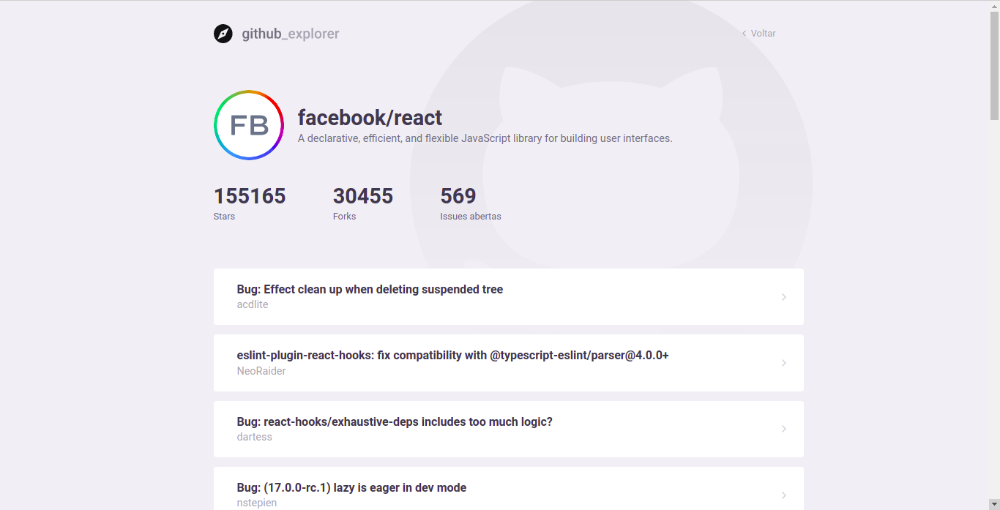

<h1 align="center">
    
</h1>

<p align="center">
  
  
  
  
</p>

<p align="center">
  <a href="#bookmark-sobre">Sobre</a>&nbsp;&nbsp;&nbsp;|&nbsp;&nbsp;&nbsp;
  <a href="#rocket-tecnologias">Tecnologias</a>&nbsp;&nbsp;&nbsp;|&nbsp;&nbsp;&nbsp;
  <a href="#wrench-ferramentas-utilizadas">Ferramentas Utilizadas</a>&nbsp;&nbsp;&nbsp;|&nbsp;&nbsp;&nbsp;
  <a href="#boom-como-executar">Como Executar</a>&nbsp;&nbsp;&nbsp;|&nbsp;&nbsp;&nbsp;
  <a href="#memo-licença">Licença</a>
</p>

## :art: Layout

<p align="center">
  
  
</p>


## :bookmark: Sobre

O **Github Explorer** é uma aplicação Web feita para agrupar repositórios do Github de acordo com a preferência do usuário. Por meio dela é possível consultar repositórios e visualizar informações como stars, forks e issues.

Essa aplicação foi realizada durante o **Bootcamp GoStack** da [Rocketseat](https://rocketseat.com.br/).

## :rocket: Tecnologias

<p float="left">
  
  
  
  
</p>

-  [CSS3](https://www.w3schools.com/css/)
-  [HTML5](https://www.w3schools.com/html/)
-  [ReactJS](https://pt-br.reactjs.org/)
-  [TypeScript](https://www.typescriptlang.org/)

## :wrench: Ferramentas Utilizadas

- **axios** - Pacote responsável por fazer as requisições no front end.
- **polished** - Biblioteca que permite a manipulação de cores.
- **react-icons** - Pacote que possui todos os ícones de fontes para aplicações React.
- **react-router-dom** - Dependência responsável por lidar com as rotas da aplicação.
- **styled-components** - Pacote responsável por customizar as estilizações dos componentes.


## :boom: Como Executar

- ### **Pré-requisitos**

  - É **necessário** possuir o **[Git](https://git-scm.com/)** instalado e configurado.
  - É **necessário** ter um gerenciador de pacotes seja o **[NPM](https://www.npmjs.com/)** ou **[Yarn](https://yarnpkg.com/)**.
  - É **necessário** ter um **browser** instalado.

1. Faça um clone do repositório:

```sh
  $ git clone https://github.com/ianbmesquita/react-github-explorer.git
```

2. Executando a Aplicação:

```sh
  # Acessando o diretório da aplicação.
  $ cd react-github-explorer

  # Instalando as dependências do projeto.
  $ yarn # ou npm install

  # Inicializando o servidor ReactJS.
  $ yarn start # ou npm start	
```

3. Será aberta uma página no browser por meio do endereço **http://localhost:3000/**


## :memo: Licença

Esse projeto está sob a licença MIT. Veja o arquivo [LICENSE](LICENSE.md) para mais detalhes.

---
<sup>Projeto desenvolvido com a tutoria de [Diego Fernandes](https://github.com/diego3g), da [Rocketseat](rocketseat.com.br).</sup>
